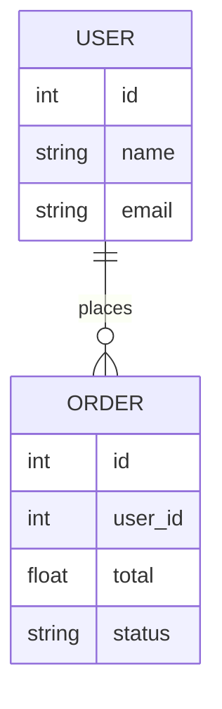

# Database Schema Template

_What are the main entities and relationships in your data model?_

---

## ER Diagram

<small>(Example diagram. Replace or expand as needed for your project.)</small>

---

## Entities

### User
- **id**: int, auto-increment  
  <small>(Primary key, unique identifier. Example only.)</small>
- **name**: string  
  <small>(Name of the user. Example only.)</small>
- **email**: string  
  <small>(Email address, must be unique. Example only.)</small>

### Order
- **id**: int  
  <small>(Primary key. Example only.)</small>
- **user_id**: int  
  <small>(Foreign key, relates to User. Example only.)</small>
- **total**: float  
  <small>(Order total amount. Example only.)</small>
- **status**: string  
  <small>(Status of the order, e.g., "pending", "completed". Example only.)</small>

<small>(Example entities. Replace or expand as needed for your project.)</small>

---

## Relationships

- One **user** can place many **orders**.  
- Each **order** belongs to a single **user**.  
  <small>(Examples only. Adjust for your project.)</small>

---

<small>Add more entities and relationships as your project grows.</small>
